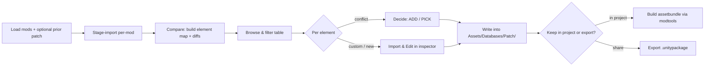

# Compatibility Patcher — Design Spec

> **Status:** editor tool scaffolded in `Assets/Scripts/Editor/CompatPatcher/` (6 files). The read + N-way
> diff + classification core is **validated to match the standalone prototype** on the real ENC + VIP mods
> (428 conflicts / 533 ADD / 176 odin / 67 identical, all matching; PICK 439 vs 463 — a small
> canonicalization delta still to reconcile). **Deferred / basic:** automatic patch-collection emit (union
> merge + packaging) — v1 builds `Patch/` elements via **Import & Edit**; the sidecar + report export work.
> Needs an in-Unity compile pass (the UI files couldn't be headless-compiled) and UI refinement.

## Purpose

Several database mods (each adding cultures, units, techs, districts…) frequently touch the **same
elements**. Humankind loads elements into per-type datatables keyed by **element name** and applies
**load-order-wins as whole-element replacement** — it does *not* field-merge. So when two mods define the
same element, the last-loaded one wins outright and the earlier mod's contribution silently vanishes.

Today the only way to find and reconcile this is comparing files by hand. This tool compares the loaded
mods, surfaces exactly where they collide, lets you resolve each collision, and emits a **patch mod
("Mod C")** containing only the resolved elements — to be loaded last.

## Scope & non-goals

- **In:** compare N external mods (`.unitypackage` / `.zip` / folder / `.assetbundle`) against **each
  other**; produce a patch; support **re-patching** against a previously-made patch. `.assetbundle`
  sources stay mounted for the session (in-memory compare; inspector refs resolve like vanilla).
- **Out:** no vanilla baseline. Vanilla-version drift is handled by other tools; our reference for "what
  changed since last time" is each mod's **own current state vs. the state recorded in the prior patch's
  sidecar**.
- **Out (v1):** auto-inferring a mod's rebalance and replaying it; authoring formulas from scratch
  (infix→RPN). Both are handled manually via **Import & Edit** (below) in v1.

## Core model

### Element identity — path-agnostic
Identity is **(element-type, element-name)**, never file/collection/folder/path. The game keys on element
name; which `.asset` or collection an element sits in is editor bookkeeping only, and mods organise
differently (e.g. ENC splits `EmpireBonusDescriptor_Added` / `_Modified` where another mod uses one file).
Every `.asset` under `Assets/Databases/` in a mod is flattened into one element map keyed by name+type.

- `element-name` = the object's `m_Name`.
- `element-type` = the `m_Script` `guid:fileID` (distinguishes the concrete element class; also separates
  **collection-root** container objects, which are excluded from conflict analysis).

### Conflict classification
For each element present in ≥2 mods, in load order (**last = winner**), diff winner vs. the others:

| Kind | Meaning | Default resolution |
|---|---|---|
| `missing_in_winner` | winner drops an entry/field another mod has | **ADD** (union) |
| `changed`           | present everywhere but values differ        | **PICK** (choose) — or Import & Edit |
| `extra_in_winner`   | winner has something others don't           | informational (winner keeps it) |
| `identical`         | all equal                                   | none |
| *new*               | single-mod only, no conflict                | none — but editable via the browser |

Field/entry diffs are **structured**: dicts recurse; list entries align by identity key
(`EffectId`, `serializableElementName`, `TargetProperty`, `Name`, `TargetID`, `Type`, `Descriptor`); keyless positional
lists (e.g. RPN `ConstantStack`) compare as one unit. Diffs are **N-way** — every row shows each mod's value.

### Odin-node payloads
Some types keep lists in the Odin `SerializationNodes` stream (e.g. `TechnologyDefinition.SimulationEventEffects`,
`NarrativeEventDefinition` → `Choices[].NarrativeEventEffects`). For **live** objects (assetbundle mounts)
`LiveElementBuilder` reflection-merges those effect trees into the element body before Flatten, so Amount /
enums / refs StructDiff like ordinary fields. YAML-only sources without a live object still fall back to
element-reference-set diff (`RefDiff`) for **opaque** Odin shells (body is only `serializationData`).
Hybrid assets that also have Unity-serialized gameplay fields (many units) StructDiff those fields —
a single `ProductionCost` swap is **CHANGED/PICK**, not `MISSING refs[OldName]`.

## Workflow

1. **Load** the external mods (set load order) and, if re-patching, the prior patch + its sidecar.
2. **Read the sources.** Analysis is **read-only text extraction** — extract each mod's `.asset` bytes
   (gzip+tar for `.unitypackage`, `ZipArchive` for `.zip`, direct for folders) and parse the YAML; the source
   mods are **never** brought into the AssetDatabase. In particular we **never `AssetDatabase.ImportPackage`**
   a source mod — that imports at its embedded `Assets/Databases/…` paths, which would overwrite the other
   mods *and clobber the real project's files*. Only when you **Import & Edit** a specific element do we need a
   live object: the element's *whole source `.asset`* is staged to a scratch path we control
   (`Assets/_PatcherStage/<ModName>/…`, never the embedded path), imported so Unity/Odin hand back a live
   `IDatatableElement`, which is then duplicated into the `Patch/` collection via
   `DatatableElementCollectionUtility.GetOrCreateDatatableElementCollection` + `TryDuplicateDatatableElements`
   (`ensureUniqueName:false` → overrides by name) — the same calls `OverrideVanillaElement` uses. Scratch
   staging is deleted afterwards.
3. **Compare** → element map + diffs + resolved/needs-review status.
4. **Browse, filter, decide** in the window (below).
5. Resolved/edited elements are written into **`Assets/Databases/Patch/`** (the patch mod, "Mod C"), and the
   sidecar is refreshed.
6. **Deliver** — your choice: leave it **in the project** (then build the game assetbundle via the modtools'
   own bundle step), or **export a `.unitypackage`** for sharing. The patcher does *not* build the
   assetbundle — that stays the modtools' existing pipeline.

## The window

A `DescriptorPropertyIndex`-style browser (reuse its multi-column header, sort, virtualized rows,
ping-on-click, dropdown+text filters) where **rows are elements across the loaded mods**.

**Filters (AND-combined):**
- Status toolbar: `All · Conflicts · New · Identical`
- Name (substring)
- Type (dropdown, populated from loaded elements)
- Defined-by (which mod[s] touch it)
- Resolution (`ADD` / `PICK` / needs-review / resolved)

**Columns:** name · type · defined-by · winner · status · diff summary (`2 ADD, 1 PICK`).

**Resolution model — per-element winner + Mass Change field merge.** Whole-element import remains the
base workflow (radio → import / mark resolved). Field-level diffs are shown to explain *what* differs
(e.g. `OwnDescriptorReferences[serializableElementName=Effect_X]`, or nested
`SettlementStabilityPrerequisite.PublicOrderEffects[…]`).

**Mass Change** (v1) applies recurring ADD/PICK field edits onto **already-imported Patch** elements only
(never auto-imports), scoped by the current Type/name filters or a Ctrl/Cmd multi-selection:

- **ADD** missing `DatatableElementReference[]` entries (any field path, including nested Generics)
- **PICK** single refs / simple leaves (enums, bools, ints, floats, strings)

Mutations use `SerializedObject` with read-back verification. Complex struct-list rows
(`UnitAbility[]`, prerequisite arrays, …) stay unsupported (hand-edit in Compare).

**Row / detail actions:**
- **Compare side-by-side** — opens `CompatCompareWindow`: each contributing mod's version is staged and
  rendered with the normal inspector (`Editor.CreateEditor`, as `DatabaseBrowser` does), in parallel columns,
  for visual comparison before choosing.
- **Import chosen into Patch/** — duplicates the *chosen* mod's version into the Patch collection (honours the
  radio), via the `OverrideVanillaElement` mechanism. Primary element only — matching mappers are not
  auto-imported. Also marks the conflict **resolved** in the sidecar.
- **Mark resolved / Resolve all as winner / Compare “Resolve as winner”** — accept winner/choice without
  importing; sidecar is the memory (`✓resolved`, same review weight as `✓in patch`).
- **Mass Change… / Apply to N in Patch…** — bulk field ADD/PICK on Patch copies (import winners first).

## Incremental re-patch (the time-saver)

The patch carries a **sidecar** recording each **resolved** decision + a **fingerprint** of the source values
it was made against. On re-run:

- source values **unchanged** → decision **resolved** (hidden from review).
- source values **changed since the patch was built** → **resurfaces** for review, pre-filled with the prior
  choice.
- collisions not in the sidecar → **new**.

Two mechanisms cooperate: **ADD/union** decisions are self-verifying (if the patch is loaded last it already
contains the union, so nothing shows missing); **PICK/CUSTOM** decisions need the sidecar so an unchanged
divergence isn't re-flagged just because a loser still disagrees with the winner.

*Validated on ENC + VIP:* 428 elements with diffs on first solve → **0** on unchanged re-run (all resolved);
perturbing one value resurfaces **exactly one** element.

## Output

The patch ("Mod C") is written as database `.asset` collections under **`Assets/Databases/Patch/`** —
per-type collection assets (e.g. `Assets/Databases/Patch/TechnologyDefinition.asset`) holding only the
resolved/edited elements. Loaded **last**, it wins over the source mods for exactly those elements.

**Delivery is a choice:**
- **In project** (default) — leave it under `Assets/Databases/Patch/`; the game needs an **assetbundle**,
  which you build with the **modtools' own bundle step** (not this tool).
- **Export `.unitypackage`** — for sharing/portability; re-importable and re-patchable later.

**Sidecar** — decisions + fingerprints — is kept alongside the patch for the next re-patch. It travels with
both delivery forms (a companion asset in the folder; included in the exported package).

> The patcher's job ends at producing the database assets. Building the game-ready assetbundle remains the
> modtools' existing responsibility, so the patch flows through the same pipeline as any other mod.

## Reuse map

| Need | Existing code |
|---|---|
| Table UI, filters, sort, virtualized rows | `DescriptorPropertyIndex.cs` |
| Live Odin SimulationEventEffects → Flat (tech/narrative/civic/NP) | `SimulationEventEffectFlattener` + `LiveElementBuilder` |
| Descriptor PropertyEffects / RPN→infix (inspector tools) | `DescriptorPropertyIndex` / `PropertyEffectDrawer` |
| Import an element into the mod to edit | `VanillaDatabaseMount.OverrideVanillaElement` (generalise source) |
| Reference graph / dangling-ref detection | `DescriptorPropertyIndex.HarvestReferences` |
| Diff engine, N-way classification, sidecar round-trip | standalone prototype `hk_conflict_report.py` |

*Note:* `VanillaDatabaseMount` is **not** required for the patcher (no vanilla comparison); only the reader
pattern and the import-to-edit mechanism are reused.

## Deferred (v1.5+)

- Full **formula authoring** (infix → RPN encoder; v1 edits constants via the inspector only).
- **User-defined transform pass** (scale/offset a property across a selection, incl. new elements) — v1
  achieves the same manually via Import & Edit.
- **Dangling-reference report** (a mod references an element name nothing defines) — cheap to add on the
  `HarvestReferences` graph.
